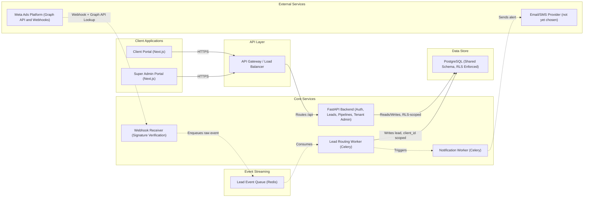

# ARCHITECTURE.md

System Architecture — Market Bytes CRM

---

## System overview

A multi-tenant CRM that ingests leads from Meta (Facebook/Instagram) ad campaigns across every Market Bytes client, and routes each one into an isolated, per-client portal. One shared database, shared schema, tenant isolation enforced by Postgres Row-Level Security — not by separate databases per client.



**The one thing that makes this system's isolation model work:** every tenant-scoped table has a `client_id` column and a Postgres RLS policy checking it against a session variable set per request. This means tenant isolation is enforced by the database itself, not by remembering to add `WHERE client_id = ...` in every query.

---

## Tech stack

| Layer | Choice | Notes |
|---|---|---|
| Frontend | Next.js / React | Client Portal + Super Admin Portal, one shared UI (no per-client branding) |
| Backend | FastAPI (async) | Single backend — API, webhook receiver, and admin functions |
| ORM / migrations | SQLAlchemy 2.0 + Alembic | Async engine for the API, sync engine for Celery workers, same model classes |
| Database | PostgreSQL | Row-Level Security enforced; two DB roles (`app_service` bypasses RLS, `app_client` doesn't) |
| Auth | JWT (`python-jose`) + `passlib` (bcrypt) | No third-party auth provider — rolled in-house, in-house is small enough at this scope |
| Background jobs | Celery + Redis | Lead Routing Worker, Notification Worker; Redis doubles as broker and queue |
| Payments | Not applicable | This system doesn't process payments |
| Email/SMS | Not yet chosen | Notification worker is currently a logging stub pending a provider decision |
| Analytics | Not yet implemented | Super Admin's "global analytics" dashboard is a planned feature, not yet built |
| Hosting (backend) | Render / Railway / AWS (undecided) | Backend + Celery workers + Postgres |
| Hosting (frontend) | Vercel | `crm.marketbytes.com` |

---

## Project structure

**Backend (`fastapi_crm/`) — exists today:**

```
fastapi_crm/
├── app/
│   ├── main.py          # FastAPI app, router registration
│   ├── config.py        # Settings loaded from environment
│   ├── database.py      # Two async engines: app_service (bypass RLS), app_client (RLS applies)
│   ├── models.py        # SQLAlchemy models — shared by the API and the Celery workers
│   ├── schemas.py       # Pydantic request/response schemas
│   ├── auth.py          # JWT creation/verification, get_current_user
│   ├── deps.py          # get_tenant_db (RLS session-variable scoping), require_role
│   ├── celery_app.py    # Celery app instance, Redis broker/backend
│   ├── tasks.py         # Lead Routing Worker + Notification Worker tasks
│   └── routers/
│       ├── auth.py          # POST /auth/login
│       ├── clients.py       # Client CRUD (super admin)
│       ├── lead_sources.py  # Page/Form-to-client mapping CRUD (super admin)
│       ├── leads.py         # Lead listing, status/assignment updates
│       ├── notes.py         # Per-lead notes
│       ├── users.py         # Team management — Client Admin invites sales reps
│       └── webhooks.py      # Meta verify-token handshake + signature-verified receiver
├── migrations/
│   └── versions/
│       └── 0002_enable_rls.py   # Enables RLS + tenant-isolation policies
├── requirements.txt
├── .env.example
└── README.md
```

**Frontend — planned, not yet created:**

```
frontend/
├── app/ (or pages/)
│   ├── (client)/         # Client Portal routes — Kanban pipeline, lead inbox, team management
│   └── (admin)/          # Super Admin Portal routes — analytics, tenant provisioning, impersonation
├── components/           # Shared UI components (one default look, no per-client theming)
└── lib/
    └── api.ts            # Typed client for the FastAPI backend
```

---

## Data flow

**Inbound lead (async path):**
1. A lead submits a form on a client's Meta ad.
2. Meta POSTs a webhook event to `POST /webhooks/meta`, containing a `leadgen_id`.
3. The receiver verifies `X-Hub-Signature-256`, then enqueues the raw payload to Celery/Redis and returns immediately.
4. The Lead Routing Worker consumes the event, calls the Graph API (via the master System User token) for name/phone/email + custom answers, matches `page_id`/`form_id` → `client_id`, and writes the lead row.
5. The routing task triggers the Notification Worker, which alerts the client (currently a logging stub).

**Regular API request (sync path):**
1. A user logs in via `POST /auth/login` — looked up via the `app_service` (RLS-bypassing) connection, since the user's tenant isn't known yet at that point.
2. The client stores the returned JWT and sends it on every subsequent request.
3. `get_current_user` decodes and validates the JWT.
4. `get_tenant_db` opens a transaction on the `app_client` (RLS-enforced) connection, sets `app.current_role` / `app.current_client_id` via `SET LOCAL`, and yields the session.
5. The route's queries run inside that transaction — Postgres RLS automatically restricts every result to the caller's tenant (or returns everything, for `super_admin`). No manual `client_id` filtering happens in route code.

**Team management — sales rep login, added by the client organization:**
1. A Client Admin (already logged in, JWT identifies their own `client_id`) calls `POST /users/invite` with an email + password for a new sales rep.
2. The endpoint ignores any `client_id` in the request body entirely — the new user is always created under the *inviting admin's own* `client_id`, taken from their JWT-resolved identity, not from client-supplied input. This is what makes it impossible for one client to create a login inside another client's tenant.
3. The new row is inserted with `role = 'sales_rep'`, scoped to that `client_id`.
4. From that point on, the sales rep logs in through the exact same `POST /auth/login` path as anyone else — no separate "sales login" system. What makes their session behave differently is only the `role` and `client_id` baked into their JWT, which `get_tenant_db` reads on every subsequent request to scope their access via RLS. A sales rep and a Client Admin at the same company hit identical endpoints; RLS plus role checks are the only things distinguishing what each can see or do.
5. Basic version: the admin sets the rep's password directly (no invite email yet) — see External services.

---

## Database & storage

- **PostgreSQL** is the only datastore in the system today. Tables: `clients`, `client_lead_sources`, `users`, `leads`, `notes`, `audit_log` — full schema in `market_bytes_crm_schema.sql`.
- **No file/blob storage is currently required** — there are no file uploads or attachments in the spec. If lead attachments or document uploads are added later, an S3-compatible object store (S3, R2, or similar) would be the natural addition; nothing in the current design depends on this.
- **Two DB roles, one database:** `app_service` (`BYPASSRLS`) for auth lookups, the webhook receiver, Celery workers, and migrations; `app_client` (RLS applies) for every regular tenant-facing API request.

---

## External services

| Service | Purpose | Status |
|---|---|---|
| Meta Graph API | Fetch full lead details (name/phone/email/custom answers) given a `leadgen_id` | Integrated — uses the master System User token |
| Meta Webhooks | Real-time notification when a lead form is submitted | Integrated — signature-verified receiver in place |
| Email/SMS provider | Notify a client when a new lead arrives, and email sales-rep invite credentials | Not yet chosen — `notify_new_lead` is a stub, and `POST /users/invite` sets a password directly instead of emailing one |

No other third-party integrations exist in the current design (no payments, no analytics SDK, no CRM-to-CRM sync).

---

## Deployment

- **Backend + Celery workers + PostgreSQL:** planned for Render, Railway, or AWS (not yet finalized). The API and worker are two separate running processes from the same codebase (`uvicorn app.main:app` vs. `celery -A app.celery_app worker`), so they can scale independently even though they share one repo.
- **Redis:** a managed instance (Upstash, Redis Cloud, or the hosting provider's managed Redis) — serves as both the Celery broker and the lead-event queue.
- **Frontend:** Vercel, served at `crm.marketbytes.com`.
- **Secrets:** all credentials (Meta App Secret, Verify Token, Master System User Token, JWT secret, DB credentials) belong in the hosting platform's secrets manager or environment configuration — never committed to the repo. The Master System User token specifically needs a rotation plan, since it has lead access across every client's Page.
- **Migrations** (`alembic upgrade head`) run via the `app_service` role, as part of the deploy step, before the new API version starts serving traffic.

---

## Scalability notes

- **Current posture: basic-first, deliberately.** Nothing below is a problem today — this section exists so scaling decisions are made when data justifies them, not preemptively.
- **Background jobs:** Celery runs with default pool/concurrency settings. At realistic agency lead volume (a handful of leads per minute at peak, even for a busy agency), a single worker process comfortably keeps up. If volume ever grows: raise `--concurrency`, or switch to a `gevent`/`eventlet` worker pool (the routing task is I/O-bound — waiting on the Graph API — so this scales close to linearly without code changes).
- **Queue/broker:** Redis handles well over 100,000 messages/second on a single small instance — not a bottleneck at any lead volume this business is likely to see.
- **Caching:** none in place. Redis is already in the stack (as the Celery broker) and could double as a cache layer later if read load on Postgres ever became a concern — not needed yet.
- **Connection pooling + RLS:** `SET LOCAL` session variables reset when a request's transaction ends, so pooled/reused DB connections are safe in principle — but this is the one assumption in the whole system worth load-testing before trusting fully in production (see the caveat in `fastapi_crm/README.md`).
- **Dead-letter handling:** a lead whose `page_id` isn't mapped to any client is currently logged and dropped. Worth revisiting (a proper holding table + alert) once new-client onboarding becomes frequent enough for this to matter.
- **Monitoring:** not yet set up. Natural additions when needed: Sentry (or similar) for error tracking, Flower for Celery task visibility, structured logging for the webhook receiver and workers.
- **Multi-region / read replicas:** not warranted at current or foreseeable scale given the lead-volume analysis already done — noted here only so it isn't reached for prematurely.
